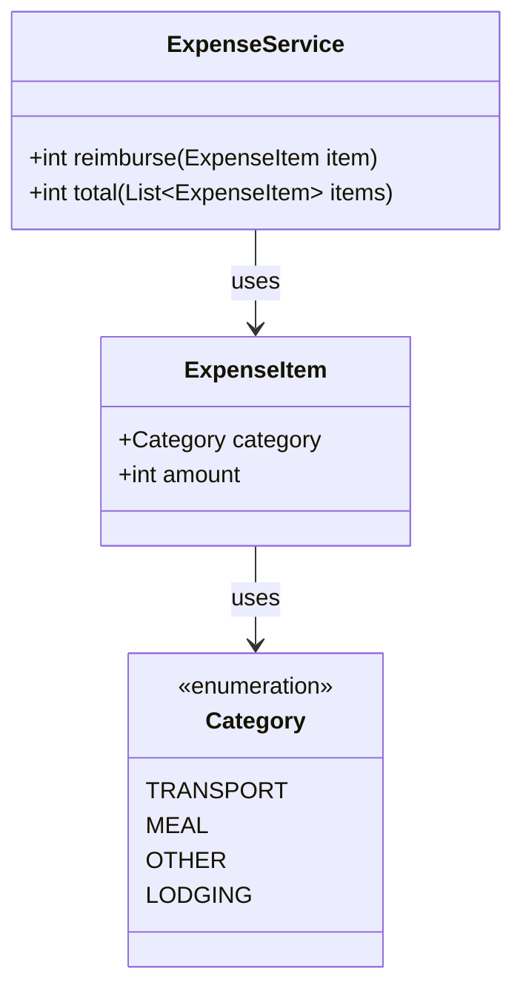

# genai-training-sandbox

生成AI新人研修（エンジニア職向け・半日）のハンズオン用サンドボックスです。
小さな経費精算サービス（Java / Spring Boot / Gradle）と、GitHub Issues によるタスク管理の練習場が入っています。

## この研修でやること

「生成AI = Webチャット」だと思っていませんか？
Claude Code のようなエージェント型AIは、Issue を読み、ブランチを切り、調査し、コードを直し、PR を出すところまで自走します。
このリポジトリで、それをあなたの手で体験します。

## 事前セットアップ（研修当日までに）

詳しい手順は [docs/事前セットアップ案内.md](docs/事前セットアップ案内.md) を見てください。以下は概要です。

対象は Windows PC、コマンドはすべて PowerShell で実行します。

1. **JDK 21** をインストール（[Temurin 21](https://adoptium.net/) の .msi、「Add to PATH」を有効に）
2. **Git for Windows** と **GitHub CLI (gh)** をインストールし、`gh auth login` で認証
3. **Claude Code** をインストール: https://claude.com/claude-code
4. 動作確認:

```powershell
git clone <このリポジトリのURL>
cd genai-training-sandbox
.\gradlew.bat test   # 初回は依存ダウンロードで数分かかります。テストが「落ちる」のは仕様です（研修の課題）
```

`BUILD FAILED`（テスト失敗）まで進めばセットアップ成功です。当日はここから始めます。

## プロジェクト構成

```
src/main/java/com/example/training/   # 経費精算サービス（バグあり）
src/test/java/com/example/training/   # 単体テスト（一部が落ちる状態）
docs/research/                        # 調査レポートの置き場
scripts/                              # 運営用スクリプト（受講者は使いません）
CLAUDE.md                             # Claude Code への作業ルール
```

## クラス構成図



## アプリの起動と使い方

### 起動

```powershell
.\gradlew.bat bootRun
```

起動後、`http://localhost:8080` でアクセスできます。

### API の使い方

#### Swagger UI（ブラウザ）

`http://localhost:8080/swagger-ui.html` を開くと、API 仕様の確認とその場での実行ができます。

#### curl での呼び出し例

**1明細の支給額を計算 (`POST /api/reimburse`)**

```powershell
curl -X POST http://localhost:8080/api/reimburse `
  -H "Content-Type: application/json" `
  -d '{"category": "TRANSPORT", "amount": 5000}'
# -> {"reimbursed":3000}
```

**複数明細の合計を計算 (`POST /api/total`)**

```powershell
curl -X POST http://localhost:8080/api/total `
  -H "Content-Type: application/json" `
  -d '[{"category":"TRANSPORT","amount":5000},{"category":"MEAL","amount":1000},{"category":"OTHER","amount":2000}]'
# -> {"total":5500}
```

費目（`category`）に指定できる値: `TRANSPORT`（交通費）, `MEAL`（食事代）, `OTHER`（その他）, `LODGING`（宿泊費）

### テストの実行

```powershell
.\gradlew.bat test
```

## 進め方

このリポジトリの Issues にタスクが積んであります。Claude Code に「次にやるべきタスクを提案して」と話しかけるところから始めてください。
作業ルールは `CLAUDE.md` にあり、Claude Code はそれを読んで Issue 駆動で動きます。

## 研修後も

このリポジトリは持ち帰りOKです。自由に Issue を足して、Claude Code との開発を続けてみてください。
